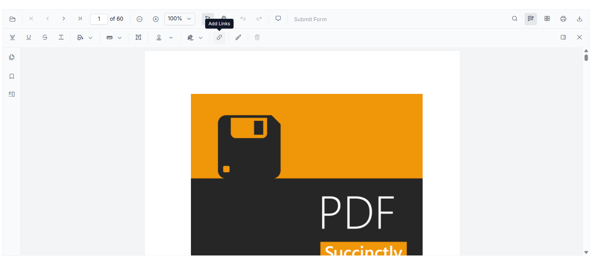
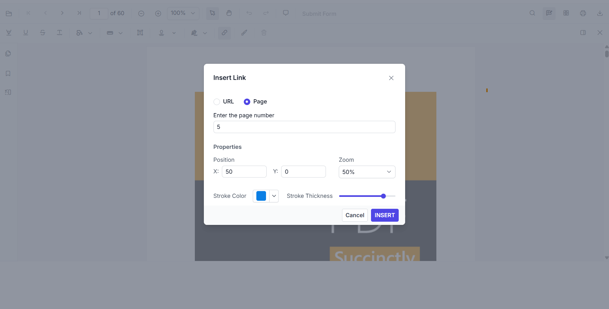
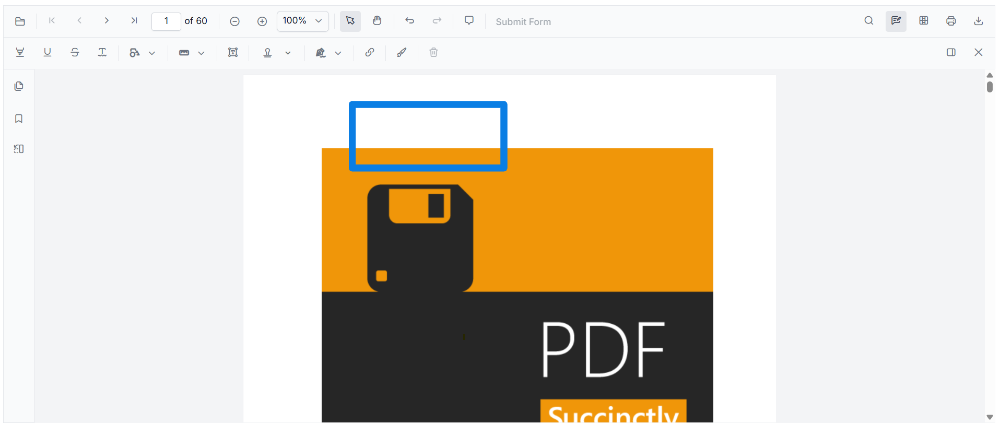
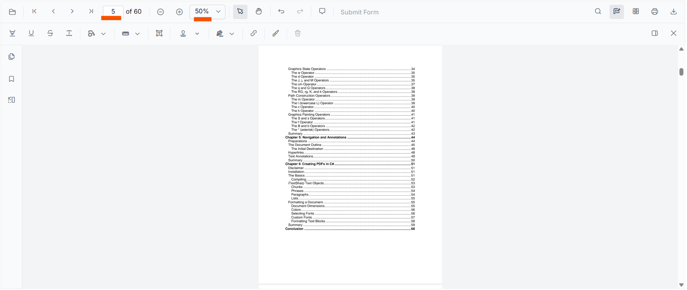

# Syncfusion React PDF Viewer — Link Annotation

A minimal React 19 + Vite application that demonstrates how to add **link annotations** to a PDF using the Syncfusion® EJ2 React PDF Viewer component.

The app loads Syncfusion's sample `pdf-succinctly.pdf` and lets you draw clickable link areas that navigate to another page (with a custom zoom level) or to an external URL.

---

## Tech Stack

| Layer            | Technology                                          |
| ---------------- | --------------------------------------------------- |
| Framework        | React 19                                            |
| Build tool       | Vite 8                                              |
| UI library       | `@syncfusion/ej2-react-pdfviewer` (v34.2.6)         |
| Theme            | `@syncfusion/ej2-tailwind3-theme`                   |
| Language         | JavaScript (JSX)                                    |

---

## Getting Started

### 1. Install dependencies

```bash
npm install
```

### 2. Run the development server

```bash
npm run dev
```

The app will start on `http://localhost:5173` by default.


---

## Implementation Overview

The whole viewer lives in [src/App.jsx](src/App.jsx). It imports the `PdfViewerComponent` and the service modules it needs (including `LinkAnnotation`) and injects them via `<Inject services={[...]} />`.

```jsx
// src/App.jsx
import {
  PdfViewerComponent, Toolbar, Magnification, Navigation,
  LinkAnnotation, BookmarkView, ThumbnailView, Print,
  TextSelection, TextSearch, Annotation, FormFields,
  FormDesigner, PageOrganizer, Inject
} from '@syncfusion/ej2-react-pdfviewer';
import './App.css';

function App() {
  return (
    <>
      <br /><br /><br />
      <PdfViewerComponent
        id="container"
        documentPath="https://cdn.syncfusion.com/content/pdf/pdf-succinctly.pdf"
        resourceUrl="https://cdn.syncfusion.com/ej2/34.1.29/dist/ej2-pdfviewer-lib"
        style={{ height: '640px' }}
      >
        <Inject services={[
          Toolbar, Magnification, Navigation, Annotation, LinkAnnotation,
          BookmarkView, ThumbnailView, Print, TextSelection, TextSearch,
          FormFields, FormDesigner, PageOrganizer
        ]} />
      </PdfViewerComponent>
    </>
  );
}

export default App;
```

### Key Points

- **`documentPath`** — the PDF to load. Can be a URL, a file from the `public/` folder, or a Base64-encoded data URI.
- **`resourceUrl`** — the path to the PDFium asset library (`ej2-pdfviewer-lib`). Required for rendering, search and text selection.
- **`LinkAnnotation`** — the service that powers the **Add Links** button in the annotation toolbar. It must be listed inside the `services` array passed to `<Inject />` for the link tool to appear.

---

## Step-by-Step: Adding a Link Annotation

The screenshots in the [`screenshots/`](screenshots) folder walk through the entire flow.

### Step 1 — Open the "Add Links" tool

In the annotation toolbar, click the **chain / link icon**. A tooltip labeled **"Add Links"** confirms the tool is active and your cursor is now in link-drawing mode.



### Step 2 — Draw a rectangle and configure the link

Click and drag on the PDF page to draw a rectangle over the area you want to make clickable. As soon as you release the mouse, the **Insert Link** dialog opens with these options:

- **URL / Page** radio buttons — choose whether the link opens an external URL or jumps to a page inside the document.
- **Enter the page number** — target page when *Page* mode is selected.
- **Position** — `X` and `Y` coordinates of the link on the page.
- **Zoom** — zoom factor the viewer should use when the link is activated.
- **Stroke Color** — color of the link's border.
- **Stroke Thickness** — width of the link's border.

Fill in the values you need and click **INSERT** to confirm.



### Step 3 — Verify the link annotation on the page

After inserting, the rectangle stays on the page with the stroke color and thickness you chose. In the example below, a blue-bordered link was drawn above the PDF cover image.



### Step 4 — Click the link to navigate

Click the link rectangle. The viewer immediately jumps to the configured target page and applies the configured zoom. In the example, the link was configured to jump to **page 5** at **50 %** zoom, which is exactly what is shown in the toolbar and the canvas.



---

## References

- [Syncfusion EJ2 React PDF Viewer — official documentation](https://ej2.syncfusion.com/react/documentation/pdfviewer/getting-started/)
